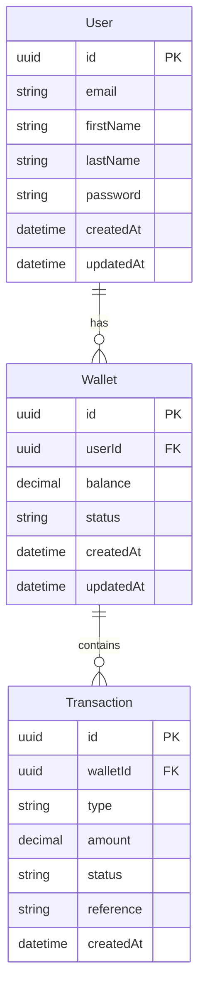

# Demo Credit Wallet Service

## Overview
This is an MVP wallet service for Demo Credit, a mobile lending application. The service provides essential wallet functionality including account creation, funding, transfers, and withdrawals.

## Features
- User account creation with Adjutor Karma blacklist validation
- Wallet funding
- Inter-wallet transfers
- Wallet withdrawals
- Faux token-based authentication
- Comprehensive unit tests

## Architecture

### Entity-Relationship Diagram


### Tech Stack
- Node.js (LTS)
- TypeScript
- MySQL
- KnexJS ORM
- Jest for testing
- Express.js
- Winston for logging

### Project Structure
The project follows a clean architecture pattern with clear separation of concerns:
- `controllers/`: HTTP request handlers
- `services/`: Business logic implementation
- `models/`: Database models and types
- `middlewares/`: Request preprocessing (auth, validation)
- `utils/`: Shared utilities
- `config/`: Configuration management
- `tests/`: Unit and integration tests

## Setup Instructions

1. Install dependencies:
```bash
npm install
```

2. Configure environment variables:
```bash
cp .env.example .env
```

3. Run migrations:
```bash
npm run migrate
```

4. Start the server:
```bash
npm run dev
```

5. Run tests:
```bash
npm test
```

## API Documentation

### Authentication
All endpoints except user creation require authentication via Bearer token.

### Endpoints

#### User Management
```
POST /api/users
GET /api/users/:id
```

#### Wallet Operations
```
POST /api/wallets/fund
POST /api/wallets/transfer
POST /api/wallets/withdraw
GET /api/wallets/balance
```

## Design Decisions

### Database Design
- Used UUID for primary keys to ensure global uniqueness
- Implemented soft deletes for audit trails
- Used decimal type for monetary values
- Enforced referential integrity through foreign keys

### Transaction Management
- Implemented database transactions for all monetary operations
- Used optimistic locking for concurrent operations
- Maintained audit logs for all transactions

### Security
- Implemented input validation
- Used parameterized queries to prevent SQL injection
- Rate limiting on sensitive endpoints
- Request validation middleware

### Error Handling
- Centralized error handling middleware
- Structured error responses
- Detailed logging for debugging

## Testing Strategy
- Unit tests for services and utilities
- Integration tests for API endpoints
- Mock external services (Adjutor API)
- Test coverage reports