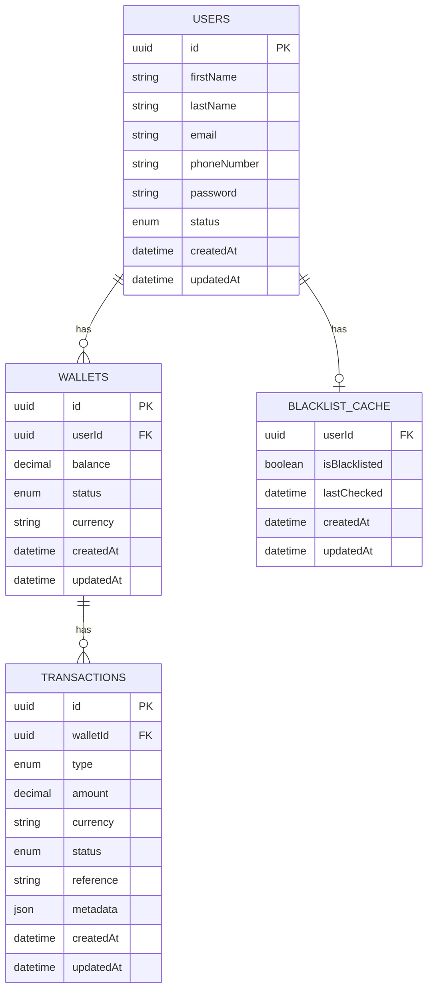

# Lendsqr Wallet Service Documentation

## Table of Contents
1. [Overview](#overview)
2. [Database Design](#database-design)
3. [API Documentation](#api-documentation)
4. [Architecture](#architecture)
5. [Setup Instructions](#setup-instructions)
6. [Testing](#testing)
7. [Deployment](#deployment)

## Overview

The Wallet Service is a microservice that enables users to perform financial transactions within the Lendsqr mobile lending application. It provides core functionality for wallet management, including account creation, funding, transfers, and withdrawals.

### Key Features
- User account creation with blacklist validation
- Wallet funding
- Wallet-to-wallet transfers
- Withdrawals
- Transaction history
- Integration with Lendsqr Adjutor Karma blacklist

### Tech Stack
- Node.js (v18 LTS)
- TypeScript
- MySQL with KnexJS ORM
- Express.js
- Jest for testing

## Database Design

### Entity-Relationship Diagram



### Database Schema Details

#### Users Table
- Primary store for user information
- Status tracks account state (active/suspended/blocked)
- Unique constraints on email and phone number

#### Wallets Table
- One-to-one relationship with users
- Balance stored as decimal(20,4) for precision
- Supports multiple currencies (defaulting to NGN)
- Status tracking for wallet state management

#### Transactions Table
- Comprehensive transaction logging
- Types: deposit, withdrawal, transfer
- Reference field ensures idempotency
- Metadata field stores transaction-specific details

#### Blacklist Cache Table
- Caches Adjutor API responses
- Reduces API calls and improves performance
- Regular cache invalidation based on lastChecked

## API Documentation

### Endpoints

#### User Management
```typescript
POST /api/v1/users
Description: Create new user account
Request:
{
  firstName: string,
  lastName: string,
  email: string,
  phoneNumber: string,
  password: string
}
Response: 201 Created
{
  id: string,
  email: string,
  firstName: string,
  lastName: string,
  createdAt: string
}
```

#### Wallet Operations
```typescript
POST /api/v1/wallets
Description: Create wallet for user
Authentication: Required
Response: 201 Created
{
  id: string,
  userId: string,
  balance: number,
  currency: string,
  status: string
}

POST /api/v1/wallets/fund
Description: Fund wallet
Authentication: Required
Request:
{
  amount: number,
  currency: string
}
Response: 200 OK
{
  transaction: {
    id: string,
    type: "deposit",
    amount: number,
    status: string,
    reference: string
  },
  balance: number
}

POST /api/v1/wallets/transfer
Description: Transfer funds between wallets
Authentication: Required
Request:
{
  receiverWalletId: string,
  amount: number,
  description?: string
}
Response: 200 OK
{
  transaction: {
    id: string,
    type: "transfer",
    amount: number,
    status: string,
    reference: string
  },
  balance: number
}
```

## Architecture

### Service Layer Architecture
```plaintext
┌─────────────────┐     ┌─────────────────┐     ┌─────────────────┐
│   Controllers   │ ──▶ │    Services     │ ──▶ │     Models      │
└─────────────────┘     └─────────────────┘     └─────────────────┘
         │                      │                        │
         │                      │                        │
         ▼                      ▼                        ▼
┌─────────────────┐     ┌─────────────────┐     ┌─────────────────┐
│   Middleware    │     │  External APIs  │     │    Database     │
└─────────────────┘     └─────────────────┘     └─────────────────┘
```

### Key Design Decisions
1. **Transaction Management**
   - All financial operations wrapped in database transactions
   - Rollback on any operation failure
   - Idempotency via transaction references

2. **Security**
   - Token-based authentication
   - Request validation middleware
   - Rate limiting for API endpoints
   - Secure password hashing

3. **Performance**
   - Blacklist caching mechanism
   - Database indexing strategy
   - Connection pooling

4. **Error Handling**
   - Centralized error handling
   - Standardized error responses
   - Detailed error logging

## Setup Instructions

1. **Prerequisites**
```bash
node -v  # Should be >= 18.0.0
npm -v   # Should be >= 8.0.0
```

2. **Environment Variables**
```env
NODE_ENV=development
PORT=3000
DB_HOST=localhost
DB_USER=your_user
DB_PASSWORD=your_password
DB_NAME=wallet_service
JWT_SECRET=your_secret
ADJUTOR_API_KEY=your_api_key
ADJUTOR_API_URL=https://api.adjutor.lendsqr.com
```

3. **Database Setup**
```bash
npm install
npm run migrate:latest
```

4. **Running the Service**
```bash
# Development
npm run dev

# Production
npm run build
npm start
```

## Testing

```bash
# Run all tests
npm test

# Run with coverage
npm run test:coverage

# Run specific tests
npm test -- -t "WalletService"
```

## Deployment

### Heroku Deployment
1. Create new Heroku app
2. Set environment variables
3. Connect GitHub repository
4. Enable automatic deploys

```bash
# Manual deployment
git push heroku main

# View logs
heroku logs --tail
```

### Monitoring
- Integration with Firebase Analytics
- Error tracking via Firebase Crashlytics
- Performance monitoring via Firebase Performance Monitoring

## Future Improvements
1. Implement webhook notifications for transaction status
2. Add support for multiple currencies and exchange rates
3. Implement transaction limits and velocity checks
4. Add support for recurring transfers
5. Implement more comprehensive audit logging